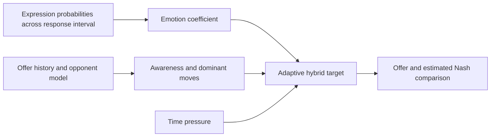

# An Adaptive Emotion-Aware Strategy for Human-Agent Negotiation: Insights from Real-World Human-Robot Experiments — [IVA 2025]

Mehmet Onur Keskin · Umut Çakan · Reyhan Aydoğan

[Paper](https://doi.org/10.1145/3717511.3747087) · [Explore the method](METHOD.md) · [Try the code](#try-it-yourself) · [Study guide](docs/protocol.md) · [Citation](#cite-the-paper)

[](https://github.com/monurkeskin/An-Adaptive-Emotion-Aware-Strategy-IVA-2025/actions/workflows/tests.yml)

This paper develops Solver into an adaptive emotion-aware negotiation strategy and evaluates it against a Hybrid baseline in human–robot interactions. Emotional feedback, reciprocal bidding, opponent awareness and time pressure all contribute to the next offer.

## Method

The published method averages categorical facial-expression probabilities over the response interval, estimates how the human responds to changes in agent behavior, and adapts concession parameters using dominant move categories. After adaptation, it compares the proposed offer with an estimated Nash-product offer.



## Study and findings

In the reported 28-participant study, Solver achieved higher agent utility and required fewer bids than the Hybrid baseline. Participants also rated Solver more highly on caring about their preferences. The paper contains the study statistics and their scope; the runnable examples here are synthetic method checks. [Read the paper](https://doi.org/10.1145/3717511.3747087).

## What you can explore

Follow the equation through a small input example, inspect the exact fruit point tables and compare Solver-first with Hybrid-first protocol configurations. The paper's categorical formulation is the method implemented by this maintained package.

| Explore | Start with | What it shows |
| --- | --- | --- |
| Adaptive method | [reproduction/method.json](reproduction/method.json) | Inspect affect, awareness and target-utility calculations. |
| Exact point profiles | [reproduction/profile-1.json](reproduction/profile-1.json) | Recompute the published fruit-sharing utility space. |
| Study order | [CONFIGURATIONS.md](CONFIGURATIONS.md) | Compare Solver-first and Hybrid-first session schedules. |

The configurations, method checks and study guides are specific to this paper. The shared [NEGOTIATOR framework](https://github.com/monurkeskin/NEGOTIATOR-IJCAI-2024) runs the negotiation,
participant/conductor views and session analysis. Its exact **2.0.0** revision is
pinned in [framework.json](framework.json); installation brings it in automatically.

The implementation follows the paper’s categorical emotion formulation. Historical branches contain different variants; [METHOD.md](METHOD.md) explains the selected behavior, adaptation order and estimated Nash comparison. The numerical adjustment for a Silent response is a documented maintenance choice, since the paper specifies its direction without a value.

## Try it yourself

Use Python 3.11 or 3.12 and Git. This first example runs locally without a robot,
camera or service account.

```bash
git clone https://github.com/monurkeskin/An-Adaptive-Emotion-Aware-Strategy-IVA-2025.git
cd An-Adaptive-Emotion-Aware-Strategy-IVA-2025
python3 -m venv .venv
source .venv/bin/activate
python -m pip install -r requirements.txt
python run.py --output demo-output
```

On Windows, create the environment with `py -3 -m venv .venv` and activate it with
`.venv\Scripts\Activate.ps1` in PowerShell.

Open **`demo-output/report/index.html`** to follow the example negotiation. The
output includes offers, utility trajectories, session records and exportable
figures. These are synthetic examples for exploring the software and method.
[Installation help](docs/compatibility.md).

### Read a calculation or open the study workspace

```bash
negotiator reproduce reproduction/method.json --output method-output
negotiator gui
```

In **New study → Import a paper or study configuration**, select
`configs/synthetic.json` for the demonstration, or `configs/protocol-solver-first.json`
to inspect the paper's protocol template. The [study guide](docs/protocol.md)
explains the remaining protocol/asset requirements and device setup.

## Data and analysis

Participant records and recordings are not included. The examples use labeled
synthetic inputs so you can run the code and inspect its calculations. Recomputing
the human-study results requires authorized access to the original inputs and
the matching analysis procedure.

[Reproducibility guide](REPRODUCIBILITY.md) · [Paper-to-code map](paper-map.json) ·
[Analysis guide](docs/analysis.md)

## Build on the work

To change a paper condition, start with its configuration and add a small test
showing the intended behavior. Shared negotiation rules belong in NEGOTIATOR;
paper-specific profiles, protocols and result recipes belong here. The
[development guide](docs/development.md) walks through these boundaries and the
test-first workflow. [Contribution guide](CONTRIBUTING.md).

## Cite the paper

If you use this method or study design, please cite the associated paper:

```bibtex
@inproceedings{emotionawarenegotiation2025,
  title = {An Adaptive Emotion-Aware Strategy for Human-Agent Negotiation: Insights from Real-World Human-Robot Experiments},
  author = {Keskin, Mehmet Onur and Çakan, Umut and Aydoğan, Reyhan},
  year = {2025},
  doi = {10.1145/3717511.3747087},
  url = {https://doi.org/10.1145/3717511.3747087}
}
```

The [citation file](CITATION.cff) provides the paper as the preferred citation.
For software provenance, also record the version and [archived 2.0.0 artifact](https://doi.org/10.5281/zenodo.22729000).
When using the shared engine in new research, cite the
[NEGOTIATOR framework paper](https://doi.org/10.24963/ijcai.2024/1012).
GPL-3.0-only; original contributors and sources are credited in [NOTICE](NOTICE).
