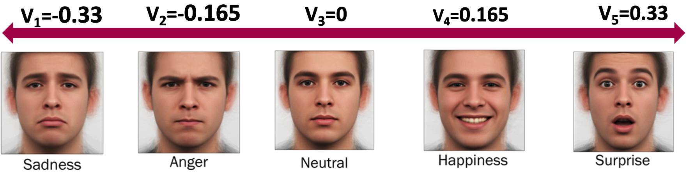
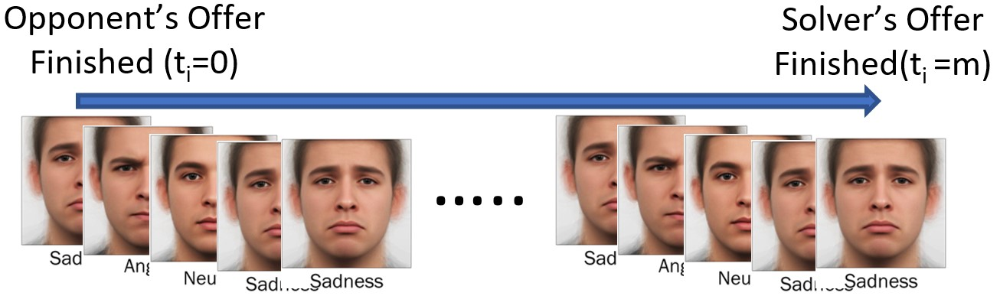
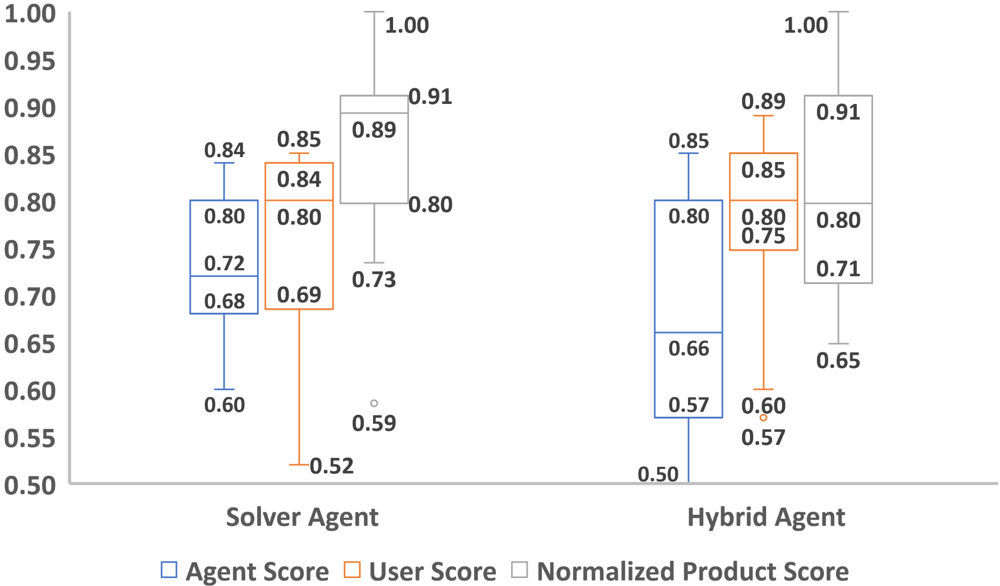

# An Adaptive Emotion-Aware Strategy for Human-Agent Negotiation: Insights from Real-World Human-Robot Experiments — [IVA 2025]

Mehmet Onur Keskin · Umut Çakan · Reyhan Aydoğan

[Paper](https://doi.org/10.1145/3717511.3747087) · [Explore the method](METHOD.md) · [Try the code](#try-it-yourself) · [Study guide](docs/protocol.md) · [Citation](#cite-the-paper)

[](https://github.com/monurkeskin/An-Adaptive-Emotion-Aware-Strategy-IVA-2025/actions/workflows/tests.yml)

An offer can look acceptable on paper while leaving its recipient visibly
frustrated. **Can a negotiating agent use that feedback to choose its next offer?**
This work develops Solver's emotion-aware strategy and compares it with a Hybrid
baseline in a study where 28 people negotiate with a NAO robot.

## How facial feedback enters the decision



*Figure 2. The method uses a weighted vector of expression probabilities instead
of selecting just the most likely category.*



*Figure 3. Frame probabilities are averaged over the response interval. Their
weighted sum gives the emotion coefficient in Equation 7.*

The opponent-awareness coefficient determines how strongly that emotion signal
affects the behavior target. Recent offers supply the reciprocal component; time
pressure supplies the concession component. Solver then adapts concession
parameters to dominant move categories and compares its candidate with an
estimated Nash-product offer. [Algorithm 1 and method walkthrough](METHOD.md).

| Part of the method | Paper reference | Explore in this package |
| --- | --- | --- |
| Emotion and awareness in the utility target | Equations 6–8; Figures 2–3 | [Calculation example](reproduction/method.json) |
| Adaptation to the human's moves | Table 2; Algorithm 1 | [Method choices and update order](METHOD.md) |
| Fruit-sharing preferences | Table 3 | [First](reproduction/profile-1.json) and [second](reproduction/profile-2.json) profile checks |
| Solver / Hybrid session order | Section 4.1 | [Study configurations](CONFIGURATIONS.md) |

## What changed in the human–robot study?



*Figure 7 shows the published distributions. Each of the 28 participants
negotiated in both conditions. The means and p-values below are reported in
Section 4.2 and Table 5.*

| Measure | Solver | Hybrid | Reported p-value |
| --- | ---: | ---: | ---: |
| Agent utility | 0.73 | 0.68 | 0.042 |
| Human utility | 0.77 | 0.79 | 0.302 |
| Normalized utility product | 0.87 | 0.82 | 0.096 |
| Total offers per session | 14.96 | 19.39 | 0.048 |
| Normalized agreement time | 0.41 | 0.51 | 0.093 |
| “Nao cared about my preferences” (1–9) | 7.71 | 6.82 | 0.047 |

Solver achieved higher agent utility, used fewer offers and received a higher
rating on caring about the participant's preferences in the reported comparisons.
Human utility, joint product and agreement time did not differ significantly
at 0.05. Participant-priority clusters were exploratory given the small sample.
[Read the study](https://doi.org/10.1145/3717511.3747087) ·
[Figure and result sources](docs/paper/README.md).

The code examples below expose the calculations with synthetic inputs. They do
not generate these published human-study results; access to original participant
records remains separate from using the method.

## What you can explore

Follow the equation through a small input example, inspect the exact fruit point tables and compare Solver-first with Hybrid-first protocol configurations. The paper's categorical formulation is the method implemented by this maintained package.

| Explore | Start with | What it shows |
| --- | --- | --- |
| Adaptive method | [reproduction/method.json](reproduction/method.json) | Inspect affect, awareness and target-utility calculations. |
| Exact point profiles | [reproduction/profile-1.json](reproduction/profile-1.json) | Recompute the published fruit-sharing utility space. |
| Study order | [CONFIGURATIONS.md](CONFIGURATIONS.md) | Compare Solver-first and Hybrid-first session schedules. |
| Participant questionnaire | [Eight published questions](docs/questionnaire.md) | Read the paper's wording, 1–9 scale and timing after each main session. |

The configurations, method checks and study guides are specific to this paper. The shared [NEGOTIATOR framework](https://github.com/monurkeskin/NEGOTIATOR-IJCAI-2024) runs the negotiation,
participant/conductor views and session analysis. Its exact **2.1.0** revision is
pinned in [framework.json](framework.json); installation brings it in automatically.

The implementation follows the paper’s categorical emotion formulation. Historical branches contain different variants; [METHOD.md](METHOD.md) explains the selected behavior, adaptation order and estimated Nash comparison. The numerical adjustment for a Silent response is a documented maintenance choice, since the paper specifies its direction without a value.

## Try it yourself

Use Python 3.11 or 3.12 and Git. This first example runs locally without a robot,
camera or service account.

```bash
git clone https://github.com/monurkeskin/An-Adaptive-Emotion-Aware-Strategy-IVA-2025.git
cd An-Adaptive-Emotion-Aware-Strategy-IVA-2025
python3 -m venv .venv
source .venv/bin/activate
python -m pip install -r requirements.txt
python run.py --output demo-output
```

On Windows, create the environment with `py -3 -m venv .venv` and activate it with
`.venv\Scripts\Activate.ps1` in PowerShell.

Open **`demo-output/report/index.html`** to follow the example negotiation. The
output includes offers, utility trajectories, session records and exportable
figures. These are synthetic examples for exploring the software and method.
[Installation help](docs/compatibility.md).

### Read a calculation or open the study workspace

```bash
negotiator reproduce reproduction/method.json --output method-output
negotiator gui
```

In **New study → Import a paper or study configuration**, select
`configs/synthetic.json` for the demonstration, or `configs/protocol-solver-first.json`
to inspect the paper's protocol template. The [study guide](docs/protocol.md)
explains the remaining protocol/asset requirements and device setup.

## Data and analysis

Participant records and recordings are not included. The examples use labeled
synthetic inputs so you can run the code and inspect its calculations. Recomputing
the human-study results requires authorized access to the original inputs and
the matching analysis procedure.

[Reproducibility guide](REPRODUCIBILITY.md) · [Paper-to-code map](paper-map.json) ·
[Analysis guide](docs/analysis.md)

## Build on the work

To change a paper condition, start with its configuration and add a small test
showing the intended behavior. Shared negotiation rules belong in NEGOTIATOR;
paper-specific profiles, protocols and result recipes belong here. The
[development guide](docs/development.md) walks through these boundaries and the
test-first workflow. [Contribution guide](CONTRIBUTING.md).

## Cite the paper

If you use this method or study design, please cite the associated paper:

```bibtex
@inproceedings{emotionawarenegotiation2025,
  title = {An Adaptive Emotion-Aware Strategy for Human-Agent Negotiation: Insights from Real-World Human-Robot Experiments},
  author = {Keskin, Mehmet Onur and Çakan, Umut and Aydoğan, Reyhan},
  year = {2025},
  doi = {10.1145/3717511.3747087},
  url = {https://doi.org/10.1145/3717511.3747087}
}
```

The [citation file](CITATION.cff) provides the paper as the preferred citation.
For software provenance, record the [2.1.0 release](https://github.com/monurkeskin/An-Adaptive-Emotion-Aware-Strategy-IVA-2025/releases/tag/v2.1.0) and commit used. The earlier [archived 2.0.0 artifact](https://doi.org/10.5281/zenodo.22729000) remains available.
When using the shared engine in new research, cite the
[NEGOTIATOR framework paper](https://doi.org/10.24963/ijcai.2024/1012).
GPL-3.0-only; original contributors and sources are credited in [NOTICE](NOTICE).
